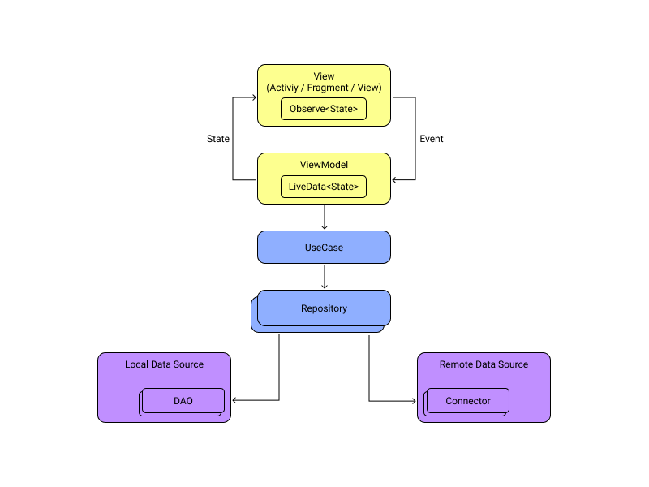

# MercadoLibre Evaluation project.
Evaluation Android app for MercadoLibre, to search products, list the results, select one and show its details.

The application makes use of the [Retrofit](https://square.github.io/retrofit/) library to implement the HTTPS client to use the [public API](https://developers.mercadolibre.com.ar/es_ar /items-and-search) from MeLi.
The dependency injection is provided by Koin Framework and for fragment navigation uses Jetpack Navigation framework.

## Architecture

MVVM (Model View ViewModel) in the presentation layer with LiveData and Coroutines + Clean Architecture.



## Linter
The project includes Ktlint and Detekt tools for analysis static code.

Running Ktlint check:
```
./gradlew ktlintCheck
```

Running Detekt check:
```
./gradlew detekt
```

## Tests

Running unit tests:
```
./gradlew test
